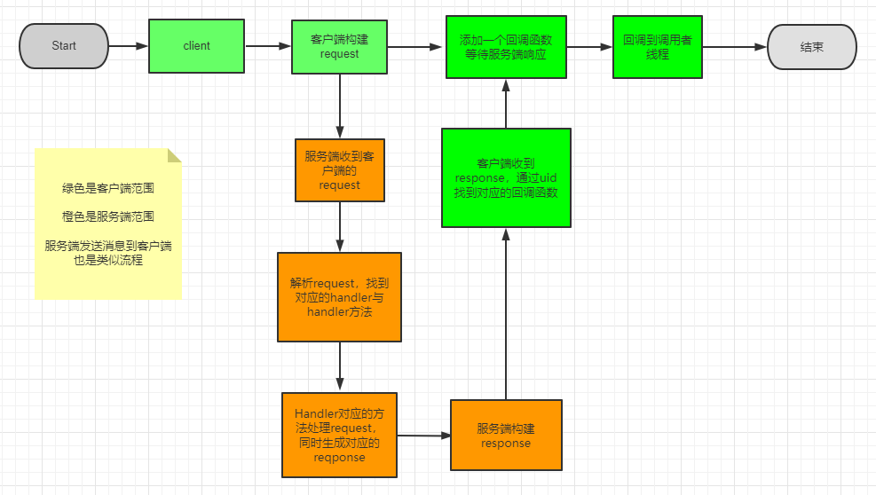
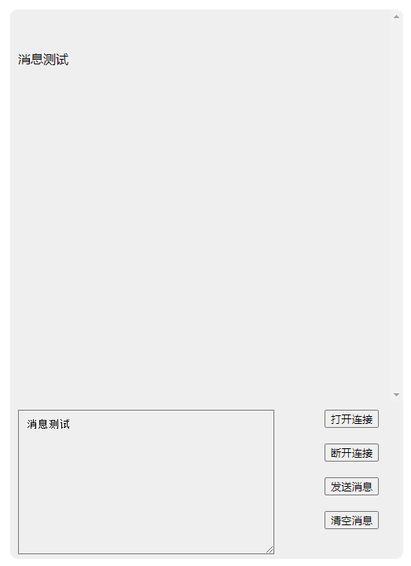

# WebSocketHttp

#### 项目介绍

使用WebSocket协议，可以非常方便的在客户端与服务端之间建立连接通道。 但是在我们的实际项目中往往会遇到以下问题：

1. 依赖于网络情况，会经常断开
2. 为了节约资源，多业务共用一个连接
3. Socket发送没有响应，不确定是否发送成功

- **WebSocketHttp** 的目的就是为了处理以上问题的一种上层约定
- 让socket之间的数据传输可以像 [HTTP](https://developer.mozilla.org/en-US/docs/Web/HTTP) 一样简单，而且是双向的
- 不单单是客户端对服务端发请求，服务端也可以对客户端发送请求

#### 需求分析

1. 为了处理第一种情况，我们需要有一种健康检查机制，定时检查连接状态，**断开重连**机制


2. 为了处理第二种情况，那我们需要约定数据格式在多个业务之间区分数据，所以我们要抽象一个“**request**”


3. 为了处理第三种情况，我们需要记录每一次发送，然后让对方给每一次“发送”发送响应，所以要抽象一个“**response**”


4. 现在抽象出了“request”与“response”，我们约定 request代表主动发送 response代表被动响应


5. Socket连接的双方，主动发数据必须按照request的格式发送，响应数据必须按response的格式响应


6. 理论上客户端发送request都应该收到一个服务端response响应，但是网络环境千变万化，很难保证


7. 所以我们需要引入超时机制，超时则客户端自己终止等待，抛出超时异常


8. 注意这里指的“客户端”与“服务端”不是传统意义上的，而是：当前谁发送request谁为客户端，谁发送response谁为服务端


9. 根据约定，抽象出的 **request** 与 **response** 格式如下

##### request

```json
{
  "uid": "",
  "handler": "",
  "method": "",
  "header": {},
  "body": "",
  "sign": ""
}
```

##### response

```json
 {
  "uid": "",
  "header": {},
  "code": 0,
  "msg": "",
  "body": "",
  "sign": ""
}
```

##### 字段说明

- **uid**：消息唯一ID（一般情况下，同一条消息request与response的uid相同）
- **handler**：消息处理器名称
- **method**：消息处理器方法
- **header**：请求头或者响应头
- **body**：消息体（可以是JSON字符串，在处理函数里面自己解析）
- **sign**：body 编码方式 -> none, url, base64
- **code**: response 状态码
- **msg**：response 状态说明

> 使用 **handler** 与 **method** 组合的方式模拟了**http**中的 **endpoint** (接口)概念
>
> 每一个 **handler** 与 **method** 都对应一个**唯一**的处理器函数
>
> **header** 与 **body** 可以给**处理器函数**传递参数

#### 消息流程



#### 软件架构

这是一个聚合项目，分有多种语言版本，每一个语言都有客户端与服务端版本，根据你的项目语言与需求进行选择。

- [golang](https://gitee.com/vesmr/websockethttp-go "golang")
- [javascript](https://gitee.com/vesmr/websockethttp-js "javascript")
- java ...
- dart ...
- c/c++ ...

#### 安装教程

- 请进入到对应语言版本的项目主页查看，如 [golang](https://gitee.com/vesmr/websockethttp-go "golang") 项目

#### 使用说明

我们通过基于 **WebSocketHttp** 来制作一个简单的聊天室来介绍如何使用

- 服务端 demo [test-websockethttp-server](https://gitee.com/vesmr/test-websockethttp-server.git)
- 客户端 demo [test-websockethttp-client](https://gitee.com/vesmr/test-websockethttp-client.git)

#### DEMO示例

##### 服务器注册 Handler 处理函数 （注意 名称 与 方法）

```go
server.RegisterRequestHandlerFunc("Default", "Default", func (context *SocketContext) {
    log.Printf("收到请求：%v", context.Request.Body)
})
```

##### 客户端发送 request 消息到服务器 Handler 处理器 （服务器响应 response）

```javascript
websockethttp.sendBodyAndHeaderMessage('Default', 'Default', {}, 'Hi', (response) => {
    console.log('response', response)
})
```

##### 服务端启动

```go
// 启动服务器
websockethttp.CreateServer().LauncherDefaultServer("/websocket/http", 8080)
```

##### 客户端界面



#### 参与贡献

1. Fork 本仓库
2. 新建 Feat_xxx 分支
3. 提交代码
4. 新建 Pull Request
