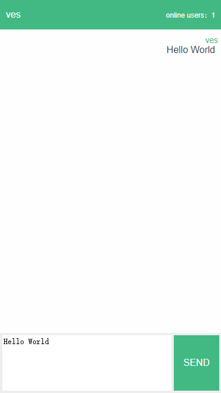

# WebSocket - Http

#### 项目介绍

> **websockethttp** 是 websocket 的一个 **子协议**，让 **websocket** 使用像 **http** 一样方便

#### 需求目标

    1. 更稳定的连接，断开能自己重连。
    2. 节约连接资源，一个连接要能满足项目大部分的业务功能使用。
    3. 对使用者友好，发送消息应该能知道消息是否发送成功。

#### 需求分析

    1. 为了处理第一种情况，我们需要有一种健康检查机制，定时检查连接状态，**断开重连**机制
    2. 为了处理第二种情况，那我们需要约定数据格式在多个业务之间区分数据，所以我们要抽象一个“**request**”
    3. 为了处理第三种情况，我们需要记录每一次发送，然后让对方给每一次“发送”发送响应，所以要抽象一个“**response**”
    4. 现在抽象出了“request”与“response”，我们约定 request代表主动发送 response代表被动响应
    5. Socket连接的双方，主动发数据必须按照request的格式发送，响应数据必须按response的格式响应
    6. 理论上客户端发送request都应该收到一个服务端response响应，但是网络环境复杂，很难保证
    7. 所以我们需要引入超时机制，超时则客户端自己终止等待，抛出超时异常，像http超时一样
    8. 连接是双向的，当前谁发送request谁为客户端，谁发送response谁为服务端
    9. 我们有了request与response，当然需要有一个统一的东西来处理它们，所以我们再定义一个叫process的负责处理，类似与web中的controller
    10. 根据约定 **request** 与 **response** 格式如下

##### request

```json
{
  "uid": "",
  "process": "",
  "header": {},
  "body": ""
}
```

##### response

```json
 {
  "uid": "",
  "header": {},
  "code": 0,
  "msg": "",
  "body": ""
}
```

##### 字段说明

- **uid**：消息唯一ID（一般情况下，同一条消息request与response的uid相同）
- **process**：消息处理器名称
- **header**：请求头或者响应头
- **body**：消息体（可以是JSON字符串，在处理函数里面自己解析）
- **code**: response 状态码
- **msg**：response 状态说明

> 使用 **process** 的方式模拟了**http**中的 **controller** (控制器)概念
>
> 每一个 **process** 都对应一个**唯一**的**处理器函数**
>
> **header** 与 **body** 可以给**处理器函数**传递参数

##### 数据优化

> request / response **字段**原则上是**固定**的，为了减少数据量，可以将 **key** 再缩减

##### request

```json
{
  "U": "",
  "P": "",
  "H": {},
  "B": ""
}
```

##### response

```json
 {
  "U": "",
  "H": {},
  "C": 0,
  "M": "",
  "B": ""
}
```

> **以上是最终的 request / response 结构**

#### 消息流程


#### 使用方式

选择你需要的语言版本

- [golang](https://gitee.com/vesmr/websockethttp-go "golang")
- [javascript](https://gitee.com/vesmr/websockethttp-js "javascript")
- java
- swift
- dart
- c/c++

请进入到对应语言版本的项目主页查看，如 [golang](https://gitee.com/vesmr/websockethttp-go "golang") 项目

我们通过基于 **WebSocketHttp** 来制作一个简单的聊天室来介绍如何使用

- 服务端 demo [test-websockethttp-server](https://gitee.com/vesmr/test-websockethttp-server.git)
- 客户端 demo [test-websockethttp-client](https://gitee.com/vesmr/test-websockethttp-client.git)

#### DEMO示例

> server 与 client 都注册了一个名称为 Message 的 Process 监听对方消息

##### 服务器 GO

```go
// server 注册 Process 监听 client 消息
websockethttp.RegisterProcessFunc("Message", func (context *SocketContext) {
    log.Printf("收到请求：%v", context.Request.Body)
})

// server 推送消息到 client 的 Process
websockethttp.sendMessage("Message", func (context *SocketContext) {
    log.Printf("发送结果：%v", context.Response.Code)
})
```

##### 客户端 JS

```javascript
// client 注册 Process 监听 server 推送
websockethttp.registerProcessFunc('Message', {}, 'Hi', (request) => {
    console.log('request', request)
})

// client 发送消息到 server 的 Process
websockethttp.sendMessage('Message', {}, 'Hi', (response) => {
    console.log('response', response)
})
```

##### Demo UI



#### 参与贡献

1. Fork 本仓库
2. 新建 Feat_xxx 分支
3. 提交代码
4. 新建 Pull Request
